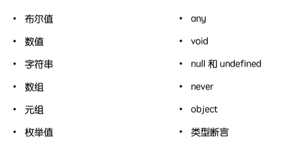

**基础类型、接口、泛型、类型推论、模块化、文件声明**

<!--more-->

## 基础类型



- object约束结构，数组约束类型，函数约束传参与返回值
- 元组示例`let tuple: [string,number,boolean]`，表示限定长度3，每个元素限定对应类型。
- 枚举值enum示例：`enum Gender { male=1,female=0 }`
-  never-真正的无返回，如函数内报错或出现死循环
- 类型断言示例

```typescript
const getLength = function(target:string | number):void{
    /*
    	if(target.length || target.length==0)	return target.length;
    	在ts里上面会报错因为如果是number是无法调用.length的,为了不报错,
        我们要进行类型断言声明
    */
    if((<string>target).length || (target as string).length==0){
        return (target as string).length
    }
    else	return target.toString().length;
}
```

## 接口


```typescript
interface defaultNode {
    // 可选属性
	className?: string,
    style?: React.CSSProperties,
    // 索引签名,接收任意多的额外属性,没有它的话是无法声明额外属性的
    // tips:所有key都会被翻译成string类型
    [propsName:string]:any
}
// 继承接口
interface Table extends defaultNode {
  dataSource?: Array<object>
}
interface Input extends defaultNode {
    title:string
}
interface MyConpoment extends defaultNode {
    table:Table,
    input:Input
}
// 基本用法
const func = function({table, input}:MyConpoment){
    ...
}
```

- 同名接口的声明会进行属性合并

## 泛型

```typescript
// 应用场景,getArray作用:构造一个填满value值,长为times的数组
// 没有泛型时,无法限制返回的array类型,即使value是数值,去调用.length时也不会报错,因为ts不限制any,但同时你又希望value可以是任意类型
const getArray = (value: any,times: number=5):any[]=> {
    return new Array(times).fill(value);
}
console.log(getArray(3,4).map(item => item.length))

// 使用泛型后,value会被动态识别为对应的类型,此时item就会被ts限制了
const getArray = <T>(value: T,times: number=5):T[]=> {
    return new Array(times).fill(value);
}
console.log(getArray(3,4).map(item => item.length))
```

## 类型推论

- TypeScript中初始赋值之后变量就有了类型，如`let arr = [1,"haha"]`，那以后arr就被定义为Array<number|string>，此时添加其他类型的元素会报错。
- 接口|对象赋值时，左边需要的右边一定要有，也就是大给小

```typescript
interface Info {
    name:string
}
let info:Info = {
    name:'z3'
};
let info1 = {name:'z3',age:18}
info = info1;//正确,左边要的右边都有
info1 = info;//报错,info1需要age而info没有
```

- 函数赋值时，左边的参数个数要小于右边的参数个数，也就是小给大(前提当然是参数的名字类型都相同)

```typescript
let info1 = function(num1:number,num2:number){};
let info2 = function(num1:number){};
info1=info2;//正确,右边要的左边都有
info2=info1;//报错,参数num2没人接
```

- 不同枚举类型之间不允许赋值，但单个枚举类型可赋值给数值类型

## 模块化

- ES6模块化导出的都是对象

```typescript
export const a = 1 //导出为{a:1}
const obj = {name:'z3'}
// export obj //错误写法,export后只能接声明或语句
const b = 1
export {b} //导出为{b:1},姑且把{}当作一种声明?或者说export{}是允许的另一种语法
export default b //导出为{default:1}
import * as xx from '..' // 这里是拿到全部export
import a from '..' // ..文件里有默认导出(default)才能这样import
```

- 命名空间与三斜线指令（一般不用，ES6模块都能实现，算是过时了）

> 命名空间在TypeScript1.5前叫内部模块，用于声明局部的区域，只有export的地方能给外部拿到
>
> 三斜线指令则用于引入内部模块

```typescript
// space.ts,存放命名空间的ts文件
namespace Validation {
    const isLetterReg = /^[A-Za-z]+$/
    export const isNumberReg = /^[0-9]+$/
    export cosnt checkLetter = (text:any)=> {
        return isLetterReg.test(text);
    }
}
    
// index.ts,使用命名空间的ts文件
/// <reference path="./space.ts" />
let isLetter = Validation.checkLetter('abc');
```

- TypeScript的模块解析系统，会先到import的路径下找对应的.ts文件，找不到就尝试找d.ts文件（其实有分classic和node两种编译系统，这里不细究了）

## TypeScript的 d.ts 文件

`d.ts文件`的出现是当需要引入外部js库的时候，为了让本地TypeScript不报错（知晓外部js库内部变量or函数的类型），于是我们就需要再编写仅包含类型注释的 `d.ts 文件`。

对于常见js外部库如jQuery，可以用DefinitelyTyped或Typings解决，前者提供了多数流行的脚本库的 TypeScript 定义，后者则直接是一个用来管理 Typescript 定义的库；前两种其实都算是第三方工具，TypeScript2.0之后，有了@types解决方案，@types应该算是npm的一个分支，即这个路径下有社区的dalao们写好的ts声明文件，可以采用`npm install @types/xxx`去尝试下载，下载成功后会出现在node_modules/@types文件夹下，TypeScript会去识别@type目录下的 `d.ts文件`并加以应用。

而对于`d.ts文件`与普通的`ts文件`而言，前者只能用export和declare开头且不会被编译。

默认情况下，`d.ts文件`为全局声明文件，declare声明的可在全局使用，但文件中出现import与export关键字后，文件变为模块声明文件，仅有export出来的属性与方法可全局使用。

如果不想让TypeScript为第三方库报错，又没有社区为这个库写声明，你也不想自己去写这个声明，TypeScript2.0之后支持使用`decalre module 'xxx'`快捷的声明xxx模块，这样TypeScript就会认识xxx这个名字而不报红

