**一些个人的AI知识总结**

<!--more-->
# AI知识大科普

# 一、LLM（大语言模型）

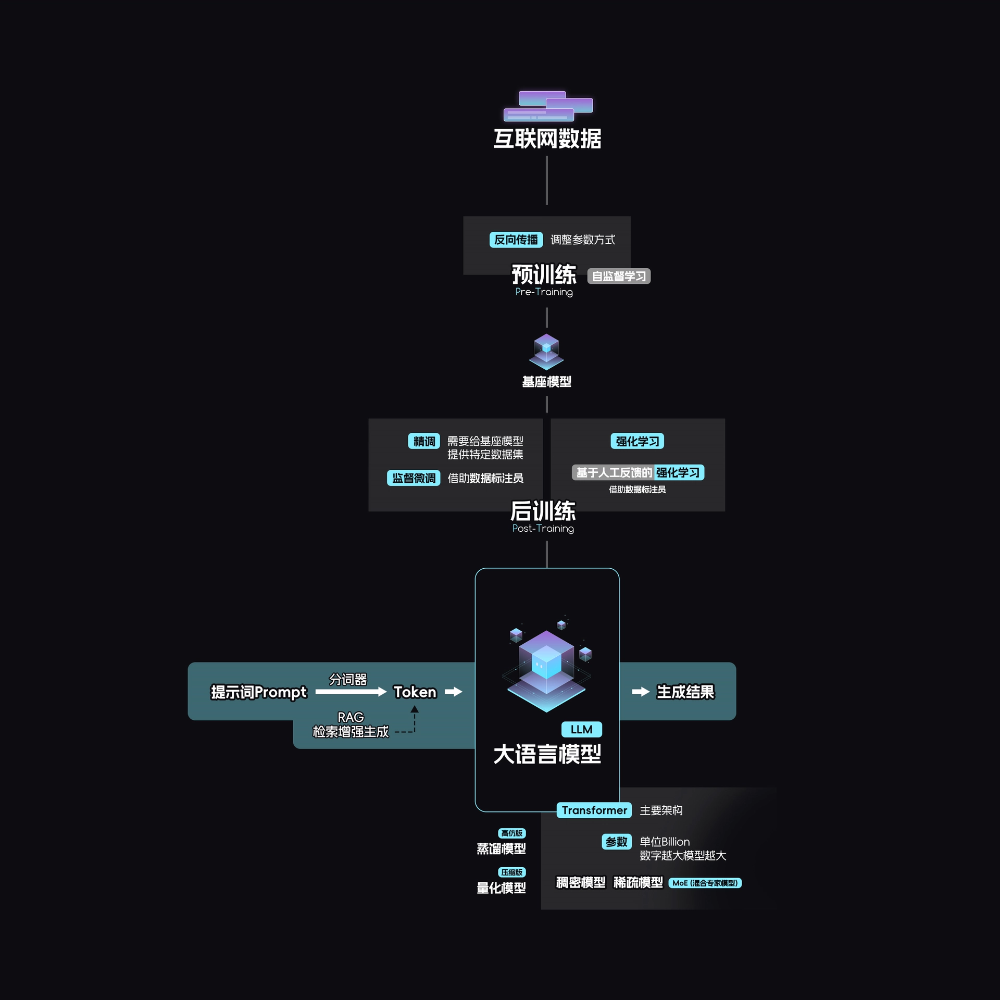

## 1.1 什么是LLM？（ChatGpt3时代）

简单理解就是一个函数F(x)，会根据你输入的内容计算出适合的输出。

其核心是Transfermer架构（值得一提的是，transfermer是谷歌AI团队在2017年提出的，但却由openAI先做出了GPT，推测原因可能是考虑大模型会冲击浏览器的广告收入，所以谷歌迟迟未推进）。

由于Transfermer的特性，大模型的输入为一整个Token串，但仅输出下一个Token，需要把生成的Token拼到之前的串后再喂给LLM，以此往复。

之所以叫大模型，因为其本质是一堆复杂的数学公式，而这些数学公式里就有很多参数，这些参数会影响生成的效果。理论上来讲，参数越多，效果越好（Scaling Law），像ChatGpt3一开始就是1750亿的参数，大模型名字的B表示的是Billion，十亿。

为什么大模型需要训练，因为这些参数的值是无法通过人工去设置他们的值的，需要通过一系列训练得到这些参数的最终值，理论上相同类型的大模型的智商就在于：参数数量、每个参数的值。

## 1.2 大模型的入参

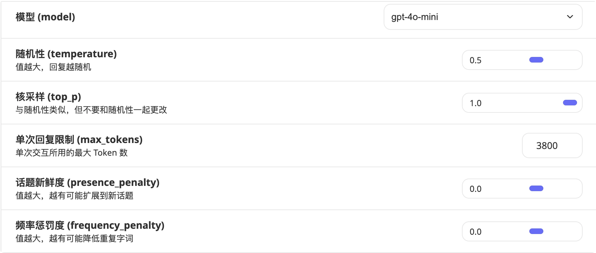

但即使是完全相同的入参，也会有不一样的输出。这份不确定性来自于哪呢？

[Defeating Nondeterminism in LLM Inference - Thinking Machines Lab](https://thinkingmachines.ai/blog/defeating-nondeterminism-in-llm-inference/)，来源于「浮点数运算精度丢失 + GPU并发计算」

## 1.3 Transfermer架构解析

大模型是怎么从Token串计算出来下一个Token的？

基于Transfermer架构训练出来的大模型就像一个图书馆系统（大模型），每次你给一个命令（Token串），系统会先解析这个命令（向量化、位置编码、注意力机制），然后在图书馆（向量空间）快速找到（前馈神经网络）合适的书（单词字符）。

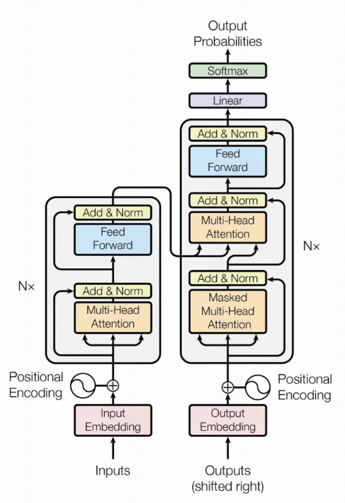

| 向量化（Embedding） | 位置编码（Positional Encoding） | 注意力机制（Attention） | 前馈网络（Feed-Forward Network，FFN） | 残差连接（Residual）与层归一化（LayerNorm） |
|---|---|---|---|---|
|  |  | 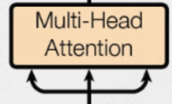 |  |  |
| 把Token串变成一个一个向量 | 计算每个Token的位置信息 | 计算每个Token的QKV Q：我想知道什么信息 K：我能提供什么信息 V：我的实际含义 | 依据前面的信息，找到下一个合适的Token（百亿级参数就在此，训练模型让百亿个参数有适合的值） | 让注意力机制和前馈网络运行时不偏离 |

## 1.4 LLM演进-训练逻辑演进

**预训练**：目的是为了训练出基座模型，通过喂大量的网上数据让他学习，让他先学会"说人话"，比如给一条评论的文本，然后他就调整自己的参数，让即使只输入文本的前半句话，它也能生成后半句。（这个阶段一般采用自监督学习，而且这个阶段理论上非常耗时，也非常消耗显卡，可能要数年半载，因为要调整的参数太多了，这是一开始大家说没钱玩不了大模型的原因）

**反向传播**：预训练的一种技术，比如"爸爸的爸爸叫__"，预期是"爷爷"，但是大模型生成的是"舅舅"，那大模型就会一直调整参数，直至生成的是"爷爷"。

**后训练（模型微调）**：基座模型只能说是一个会说人话的模型，要想做到"说的对"，还需要后训练来完成，不过这里需要的数量量已经较少了，比如chatgpt3就用了5000条就做到了能对话的程度。（这部分也就是数据标注员干的事，也是普通人能介入的最佳阶段）

**监督微调**：就是需要人来提供一些带有标注的数据集，引导模型往你需要的方向生成。

**强化学习（RL）**：这是大模型能给出接近或超越人类智能方案的核心阶段，它会决定着这个AI的大致风格走向，是目前(2025.7)多数厂商比拼的重点方向，比如DeepSeek的方案：问一个问题，挑选正确的解决方案，喂给AI让他再生成解决方案，直到模型能稳定的输出正确的答案。（这里理论上需要数据标注员去对生成答案做排序，或者搞一个奖励模型，让奖励模型个来对生成答案做排序：RLHF-基于人工反馈的强化学习）

## 1.5 LLM演进-模型演进（DeepSeek的突破）

以往的模型属于**稠密模型（Dense Model）**，输入Token时，大模型对所有参数都进行计算，计算量很大。【ChatGpt、Kimi】

DeepSeek开创了**稀疏模型（Sparse Model）**，次只调用与提示词内容相关的参数，计算量相对小一些。【DeepSeek、Grok】

具体的讲DeepSeek用的是**混合专家模型（Mixture of Experts）**，稀疏模型的一种，会通过门控网络给每个Token分配专家，然后得到权重，再去生成下一个Token。

---

# 二、Agent（智能体）

大模型是如何变成Agent的呢，其本质是「提示词工程」到「上下文工程」的转变。

- **提示词工程**：通过「设计、优化指令」提高输出效果。
- **上下文工程**：通过「构建充分上下文」提升输出效果，比如：记忆上下文、工程上下文(RAG)、外部能力上下文(MCP)

## 2.1 关联知识库能力&联网能力（RAG）

大模型是基于过往的数据的训练的，要想让他根据最近的数据进行回答，只能通过上下文塞给他了。

为了不让整个互联网知识库塞给他造成冗余，RAG则是一个快速找到与提示词相关知识库片段的技术。

大概的查找逻辑为：

- **预处理**：分片（按页数、段落等）→ 向量化（用Embedding模型）→ 存储向量数据库（key向量 value文本）
- **查找**：提示词 → 向量化（用Embedding模型）→ 粗找，找到前X个最相似的（向量相似度算法）→ 精匹配

## 2.2 长期记忆

| 策略 | 定义 | 示例 | 优缺点 |
|---|---|---|---|
| 全量记忆 | 每轮对话都保留，全部发送给模型  适用于：单次会话和简单 Q&A，大部分的 demo 都是这么搓的  | 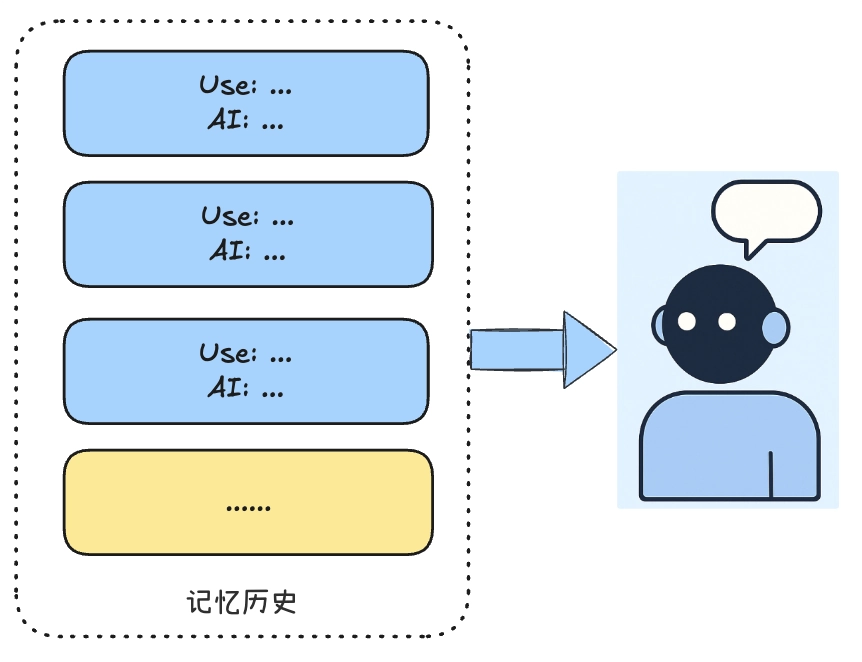 | 优点：简单，无需算法；保留完整 缺点：上下文溢出、token 超长、信息噪点 |
| 滑动窗口记忆 | 保留最近 N 轮对话，旧的自动淘汰  适用于：对记忆不依赖的单任务对话、FAQ | 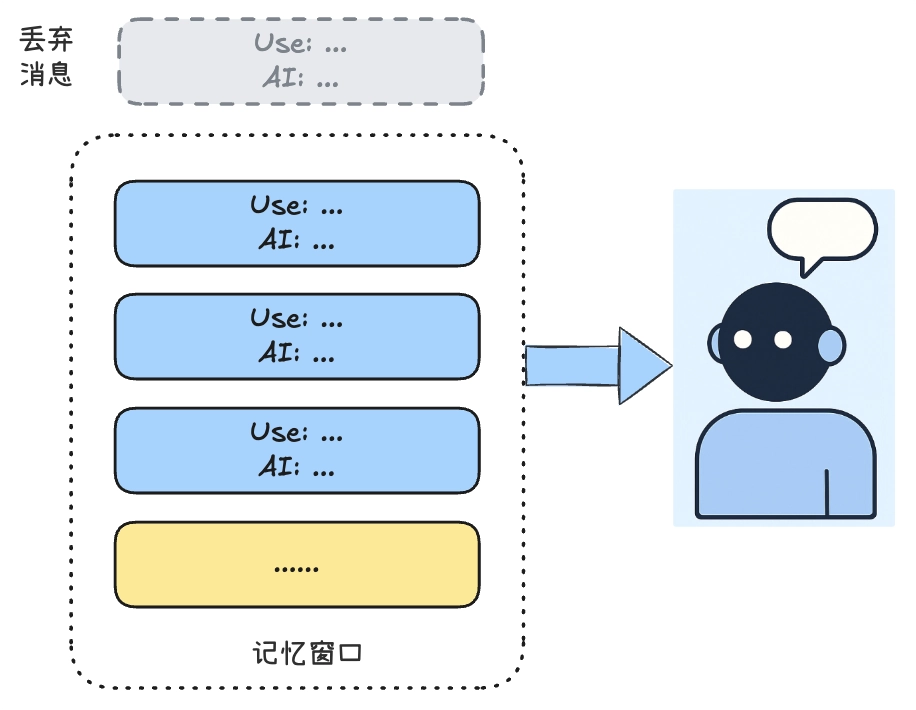 | 优点：简单粗暴 缺点：健忘性强，信息截断 |
| 相关性过滤记忆 | 根据"重要性"打分保留高分内容，清除低分记忆。即像人类一样，"遗忘记忆"  适用于：信息密集，和目的单一的场景 | 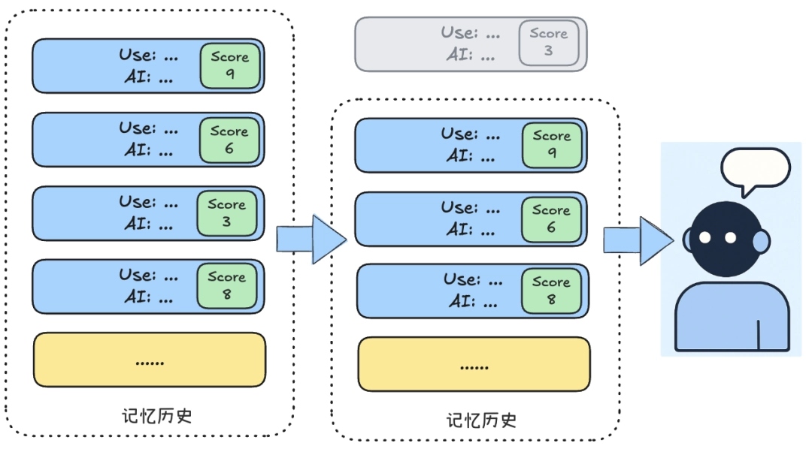 | 优点：关键知识记忆 缺点：如何准确评估"重要性"是难点 |
| 摘要/压缩记忆 | 将旧内容生成摘要保留，代替原始文本  适用于：长对话，但需要保留上下文核心要点 | 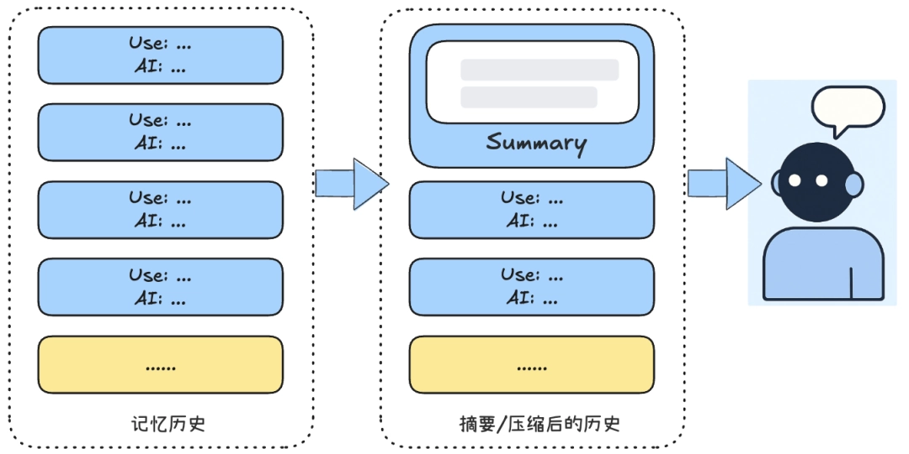 | 优点：内容精炼，节俭 缺点：摘要质量，多 > 1 轮对话耗时 |
| 向量数据库记忆 | 对对话进行嵌入，存入向量库，按语义检索  适用于：需要长期记忆的对话系统，比如 xx 助手，xx 订单咨询助手 | 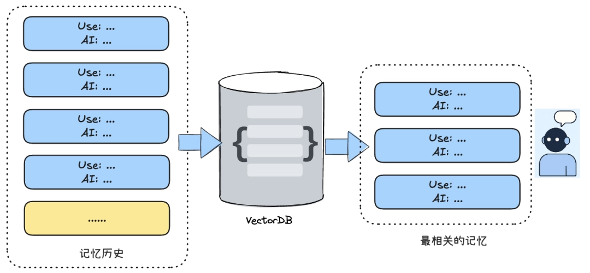 | 优点：长记忆、检索效率高 缺点：依赖向量化模型质量、算力成本、耗时 |
| 知识图谱记忆 | 将实体、属性、关系结构化成图谱，并进行图上检索和推理  适用于：知识密集型和跨场景推理，比如 xx 助手需要处理多个领域的问题并归纳 | 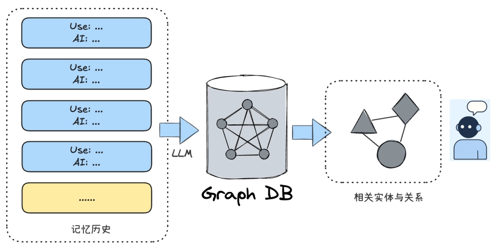 | 优点：记忆结构化、图谱 缺点：构建成本、需 LLM 二次抽取知识、算力成本、依赖模型质量 |
| 分层记忆 | 同时维护短期滑动窗口与长期语义记忆，部分内容自动"提升"到长期存储  适用于：长上下文感知、客服 Agent | 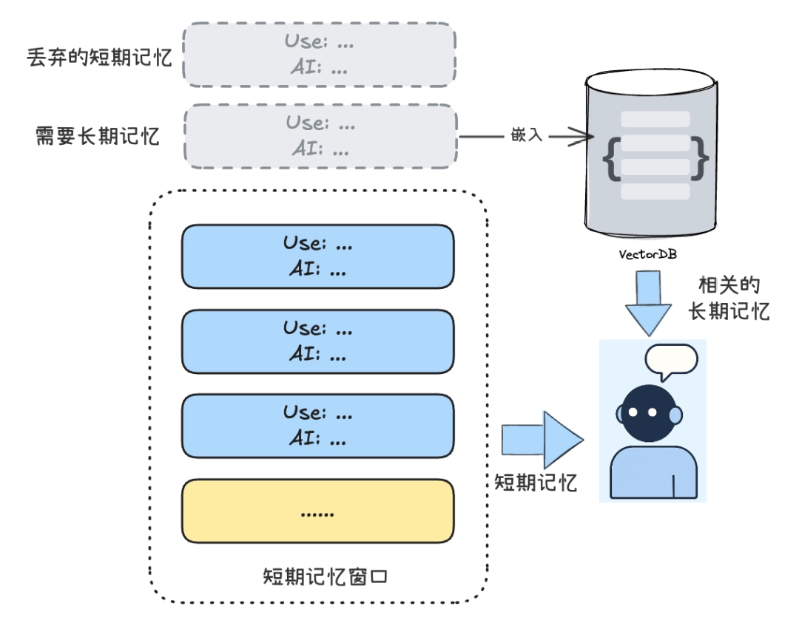 | 优点：短信息记录，长记忆检索 缺点：复杂度较高（嵌入、召回）、调优链路长，难以优化 |
| 模拟 OS 记忆管理（Swap 虚拟内存） | 类似计算机内存管理，将旧内容 page out 到外部，必要时 page in 进入上下文。对话拆分热数据（当前上下文）冷数据（外部存储）  适用于：长上下文，vibe coding（cursor 就是这么搞的） | 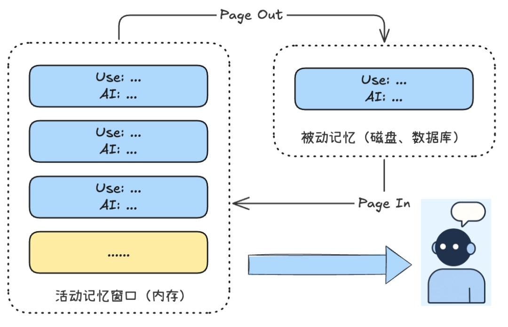 | 优点：灵活度较高 缺点：触发和分页策略 |

## 2.3 MCP与Skill

**MCP负责「连接」，Skill负责「智慧」。MCP是「厨具」，Skill是「食谱」。**

MCP的缺点：随着工具的增多，塞给智能体的上下文也会同步增多，很多工具根本用不到，完全浪费了上下文长度。

Skill的出现则是为了让智能体更聪明，它包含了用户的一些处理方法论，也就是提示词，从而按指定的要求去执行。

| | |
|---|---|
| 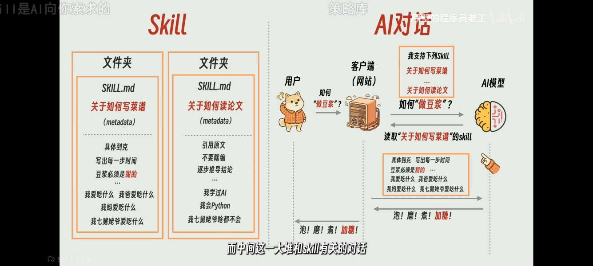 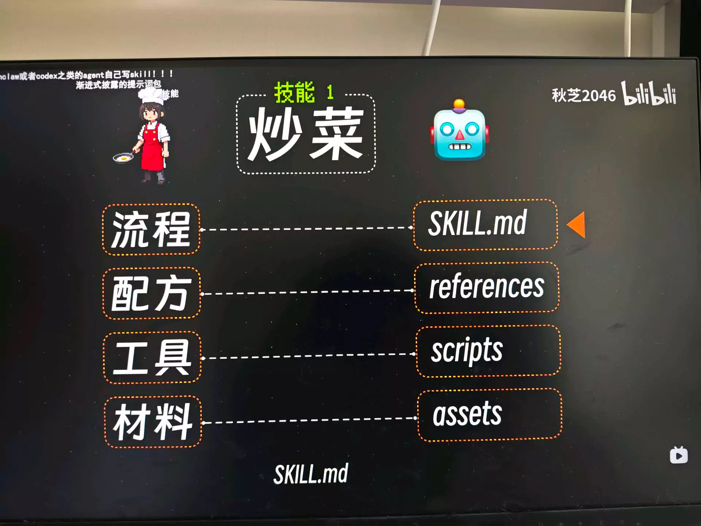 | Agent Skills 的运行方式强调**渐进式披露（Progressive Disclosure）**，从而高效管理上下文：  - **发现（Discovery）**：启动时，Agent 只加载技能的名称和描述，将 Skill List 加载到 System Prompt，用来判断技能是否相关。 - **激活（Activation）**：当任务匹配某个技能的描述时，Agent 会读取该技能的完整说明。 - **执行（Execution）**：Agent 按照说明执行任务，并在需要时加载脚本、参考资料或模板。  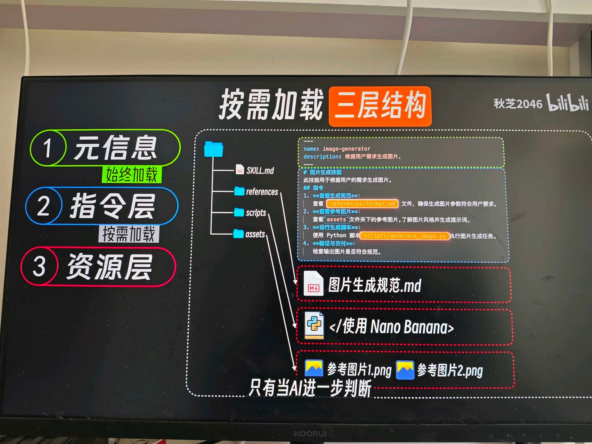 |

## 2.4 智能体实践-Agent Coding（Claude Code、cursor）

### 原理与概念

- **vibeCoding**：简单描述输出代码。
- **specCoding**：严格按早指定的格式、规范输出代码。

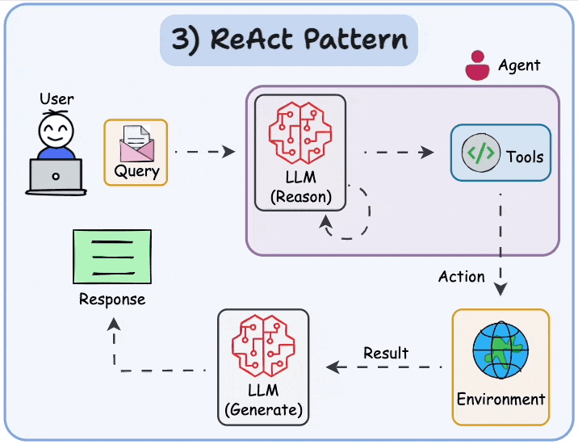

**方式一：ReAct范式（多轮思考）**

用提示词+工程化的方式，引导AI做「思考 → 执行（MCP工具）→ 观察（工具执行结果）」的循环执行，直到模型判断无需再执行时则结束。

Claude优化生码效果的策略：通过工程化的方式，让每次AI运行的上下文足够精准。（大模型+上下文=最终工作效果）

### 使用上的最佳实践

- 使用半成品设计精细化需求描述，诸如：入口文件、接口文档、UI稿、参考来源、依赖组件等
- **先方案后实现**：先和AI对齐所有颗粒度后，实现就是一气呵成的事，但是如果先让他实现再让他改，那成本会高很多，因为上下文逐渐混乱了。
- **沉淀经验**：无论是编码习惯还是犯过的错，都应该作为沉淀物料，让AI的效果越来越符合你的要求。

---

# 三、业务侧对AI应用的探索

## AI Coding Level

| 自动驾驶 | AI Coding Level |
|---|---|
| 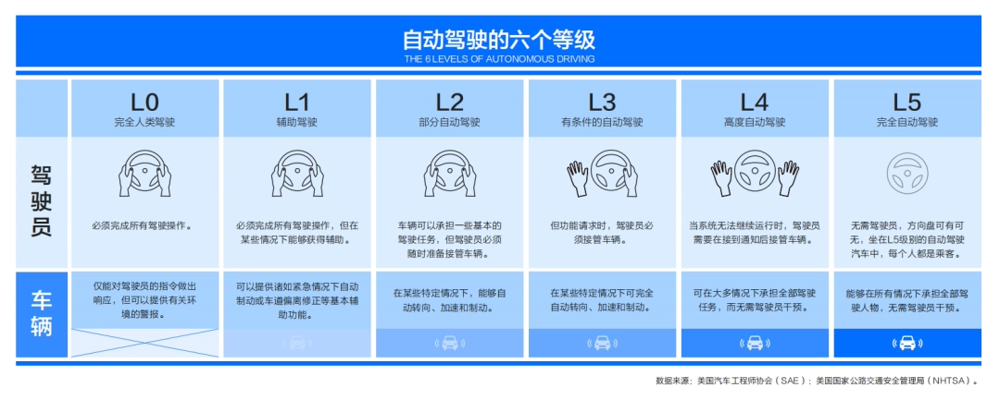  **L0**：无智能 **L1**：辅助驾驶，类似于LLM问答时代 **L2**：部分自动驾驶，AI干活，人类实时监控，主动去做接管和修正，人类对结果负责。（人不可分心） **L3**：有条件自动驾驶，限定场景下AI负责，超出限定场景人类负责，人类只在系统告知超出场景时才接管。（人可分心） **L4**：高度自动驾驶。限定场景下完全AI负责，人类仅乘客。（人不用管） **L5**：完全自动驾驶。全场景自动驾驶覆盖 | 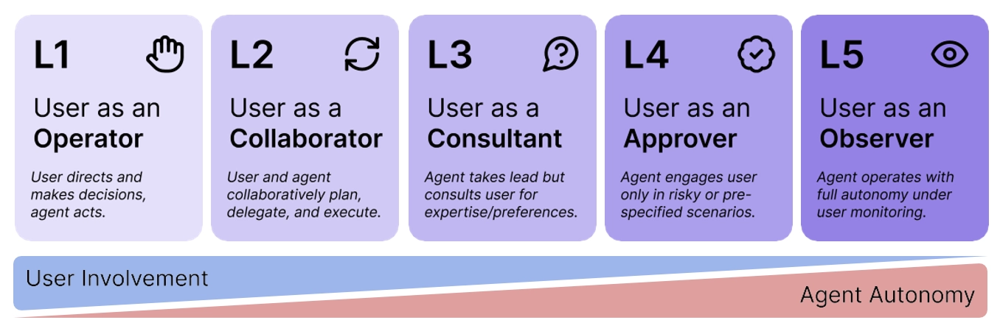  **L1**: 自动补全 / 行内提示 / 生成工具方法 **L2**: vibe coding，AI在人的引导下，AI 完成一个小块功能开发（task级别代码生成） **L3**: Agentic Code：人和AI 配合 完成 一个完整的user story开发（feature级别代码生成） **L4**: AI 工程师：输入prd 和 设计稿，完成开发到上线（人提供基础输入 和 审批上线） **L5**: AI 工程团队：输入想法，AI自行规划，探索，开发，上线，完成整体功能 |

---

# 其他

**DeepResearch**：本质是一个让大模型深度思考的架构

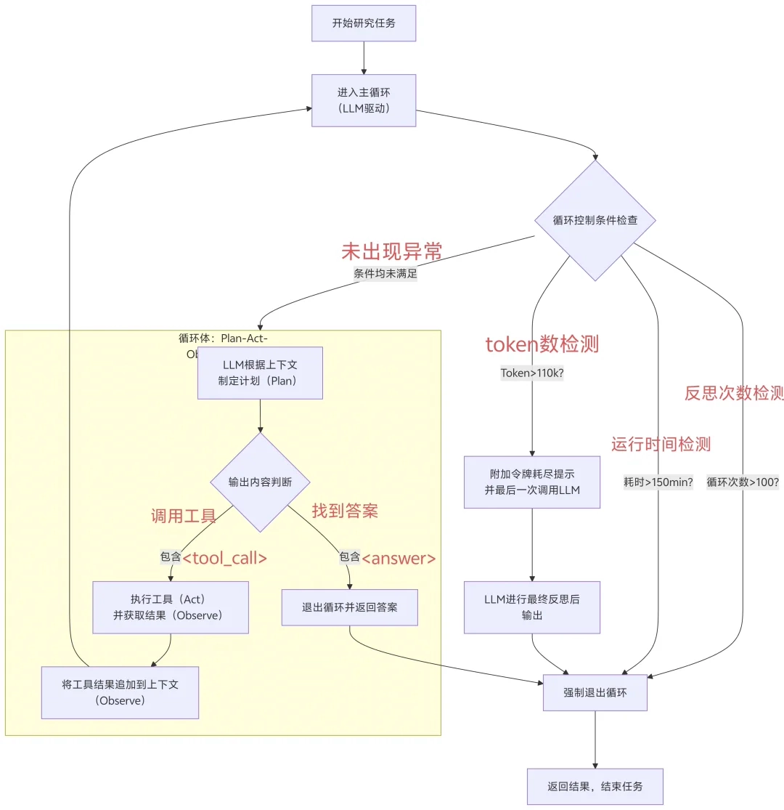

**大模型的幻觉怎么来的**：训练过程中奖励出来的，因为训练过程中奖励"猜测"不奖励"诚实"。
