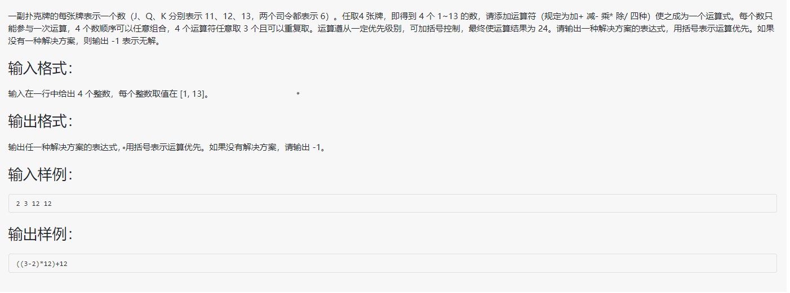

## 题目



<!--more-->


## 需要解决的问题

1. 四张扑克牌参与运算的位置（用四嵌套循环解决）
2. 三处符号的选择（用三嵌套解决）
3. 各步计算的优先级（将总共四种计算优先方式编写为函数分类计算）

## 思路
第一步：  
编写主函数,运用4嵌套循环遍历所有组合（在主函数中）(A B C D实际上只是四个容器)，然后用result计算并判断有无结果，若有，则会在result函数中输出，若无，则返回0然后主函数输出-1。  

第二步：
编写result函数，首先用三嵌套循环遍历四种运算符（即i,j,k各代表一个位置的运算符，0是加法，1是减法，2是乘法，3是除法），对应的字符已在主函数中定义了字符数组,在确定运算符的时候，同时将五种计算优先级的方式遍历（即result1 -> result5这五个函数）
，若有，则输出并返回1，若无，则返回0。  

第三步：将五种优先级编写成函数的形式（即result1 -> result5这五个函数），给result使用。
做到优先级计算不同的方法是两两计算，这里就用到三次的Result函数（第四步编写的）  

第四步：为`简化`第三步，编写Result函数用于计算俩数字之间的值。

## 代码区
```c
#include<stdio.h>
#define N 4//4张扑克牌 
#define NUM 24//要凑出的点数 
int result(int arr_in[],char op[]);
//用于遍历运算符并用各种优先级计算 
double Result(double a,double b,int op);
//这个函数用于五种优先级中的计算 
//a b c d用double是因为有可能有小数解，如 (4/10+2)*10=24
double result1(double a,double b,double c,double d,int i,int j,int k); 
//[(A B) C] D
double result2(double a,double b,double c,double d,int i,int j,int k);
//[(A B)(C D)]
double result3(double a,double b,double c,double d,int i,int j,int k);
//[A (B C)] D
double result4(double a,double b,double c,double d,int i,int j,int k);
//A [(B C) D]
double result5(double a,double b,double c,double d,int i,int j,int k);
//A[B (C D)]
int main()
{
	int i,j,k,t;
	int flag=0;
	int arr[N];//存放四个数字
//	printf("请输入你抽到的%d张扑克牌，我们将为您凑出%d点\n",N,NUM);
	for(i=0;i<N;i++)	scanf("%d",&arr[i]);
	char op[4]={'+','-','*','/'};//存放四个符号,其实只是用于输出的时候能用上 
	for(i=0;i<N;i++)
	{
		for(j=0;j<N;j++)
		{
			if(j==i)	continue;
			for(k=0;k<N;k++)
			{
				if(k==i || k==j)	continue;
				for(t=0;t<N;t++)
				{
					if(t==i || t==j || t==k)	continue;
					int arr_in[4]={arr[i],arr[j],arr[k],arr[t]};
					flag=result(arr_in,op);//将俩数组传入
					if(flag)	return 0;//如果找到了，那就结束吧,当然要是去掉这句话的话，就能找到所有的计算方法 
				}
			}
		}
	}
//	printf("对不起，这四张牌无法凑出24点\n");
	printf("-1");
} 

int result(int arr_in[],char op[])
{
	int i,j,k;
	double sum;//这里一定要是double，不然的话样例就直接出错，会把1/4当成0 
	for(i=0;i<N;i++)
	{
		for(j=0;j<N;j++)
		{
			for(k=0;k<N;k++)
			{
				sum=result1(arr_in[0],arr_in[1],arr_in[2],arr_in[3],i,j,k);
				if(sum==NUM)//[(A B) C] D
				{
					printf("((%d%c%d)%c%d)%c%d\n",arr_in[0],op[i],arr_in[1],op[j],arr_in[2],op[k],arr_in[3]);
					return 1;//返回1并结束程序，同样的，去掉这句话能找到所有的计算方法 
				}	
				sum=result2(arr_in[0],arr_in[1],arr_in[2],arr_in[3],i,j,k);
				if(sum==NUM)//[(A B)(C D)]
				{
					printf("(%d%c%d)%c(%d%c%d)\n",arr_in[0],op[i],arr_in[1],op[j],arr_in[2],op[k],arr_in[3]);
					return 1;//返回1并结束程序，同样的，去掉这句话能找到所有的计算方法 
				}	
				sum=result3(arr_in[0],arr_in[1],arr_in[2],arr_in[3],i,j,k);
				if(sum==NUM)//[A (B C)] D
				{
					printf("(%d%c(%d%c%d))%c%d\n",arr_in[0],op[i],arr_in[1],op[j],arr_in[2],op[k],arr_in[3]);
					return 1;//返回1并结束程序，同样的，去掉这句话能找到所有的计算方法 
				}	
				sum=result4(arr_in[0],arr_in[1],arr_in[2],arr_in[3],i,j,k);
				if(sum==NUM)//A [(B C) D]
				{
					printf("%d%c((%d%c%d)%c%d)\n",arr_in[0],op[i],arr_in[1],op[j],arr_in[2],op[k],arr_in[3]);
					return 1;//返回1并结束程序，同样的，去掉这句话能找到所有的计算方法 
				}	
				sum=result5(arr_in[0],arr_in[1],arr_in[2],arr_in[3],i,j,k);
				if(sum==NUM)//A[B (C D)]
				{
					printf("%d%c(%d%c(%d%c%d))",arr_in[0],op[i],arr_in[1],op[j],arr_in[2],op[k],arr_in[3]);
					return 1;//返回1并结束程序，同样的，去掉这句话能找到所有的计算方法 
				}	
			}
		}
	}
	return 0;//如果找不到就返回0 
}
double Result(double a,double b,int op)
{
	if(op==0)	return a+b;
	if(op==1)	return a-b;
	if(op==2)	return a*b;
	if(op==3)	return a/b;
	else	return 0;//如果不是这些符号则返回0,当然，其实这句话意义不大 
}
double result1(double a,double b,double c,double d,int i,int j,int k)//[(A B) C] D
{
	double r1,r2,r3;
	r1=Result(a,b,i);
	r2=Result(r1,c,j);
	r3=Result(r2,d,k);
	return r3;
}
double result2(double a,double b,double c,double d,int i,int j,int k)//[(A B)(C D)]
{
	double r1,r2,r3;
	r1=Result(a,b,i);
	r2=Result(c,d,k);
	r3=Result(r1,r2,j);
	return r3;
}
double result3(double a,double b,double c,double d,int i,int j,int k)//[A (B C)] D
{
	double r1,r2,r3;
	r1=Result(b,c,j);
	r2=Result(a,r1,i);
	r3=Result(r2,d,k);
	return r3;
} 
double result4(double a,double b,double c,double d,int i,int j,int k)//A [(B C) D]
{
	double r1,r2,r3;
	r1=Result(b,c,j);
	r2=Result(r1,d,k);
	r3=Result(a,r2,i);
	return r3;
} 
double result5(double a,double b,double c,double d,int i,int j,int k)//A[B (C D)]
{
	double r1,r2,r3;
	r1=Result(c,d,k);
	r2=Result(b,r1,j);
	r3=Result(a,r2,i);
	return r3;
}
```
参考链接：https://blog.csdn.net/qq_27494201/article/details/101389151