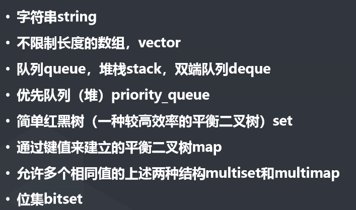

**递归与分治，树结构基础，排序补充(基数排序，快速排序，归并排序，树状数组)，STL容器**

<!--more-->

## 一、树结构基础

**树：**树是一种数据结构，它是由n（n>=1） 个有限节点组成一个具有层次关系的集 合。把它叫做“树”是因为它看起来像 一棵倒挂的树，也就是说它是根朝上， 而叶朝下的。

**二叉树：**一个父亲只能有两个儿子，而且儿子分左右。

**满二叉树:**除最后一层无任 何子节点外，每一层上的所 有结点都有两个子结点的二 叉树。 

**完全二叉树：**除最后一层外， 每一层上的节点数均达到最大值；在最后一层上只缺少 右边的若干结点。


运用二叉树的特征：如上图，对应的编号关系：左=根\*2，右=根\*2+1，根=儿子/2。

##### 二叉树的四种遍历：

​	1.根据根的排序分为的三种遍历：先序遍历(根-左-右)，中序遍历(左-根-右)，后序遍历(左-右-根)。

​	2.层序遍历：从左到右，从上到下。


​	3.巩固(如上图)：先序:ABDGHCEIFJ。中序:GDHBAEICJF。后序:GHDBIEJFCA。

###### 例1：知两序求一序：

**题目：已知前序中序求后序					Eg:前:ABCDFE 中:BADFCE**

核心：运用二叉树排序的性质(**先序排序的第一个为是根，后序排序的最后一个为根**)与递归。

注意：给出前序和后序并不能确保有唯一中序。

解题思路：设计递归函数deal(ql,qr,zl,zr)，其功能是通过前序字符在中序字符找到根。

```c++
#include <bits/stdc++.h>
using namespace std;
string q="ABCDFE",z="BADFCE";
void deal(int ql,int qr,int zl,int zr)
{
    int i;
    if(zr<zl)//当中序只剩下根-右的时候，这时如果求他的左，那他的zr就会小于zl。（只剩下左-根的时候求右也类似） 
    	return;//此时不用算，因为根本没有左了。 
	if(zr==zl)//当只有一个字符的时候
    {
		cout<<q[ql];return;
	}
	for(i=zl;i<=zr;i++)//遍历中序字符
    {	
		if(q[ql]==z[i])//找根，如果前序的第一个(也就是根)在中序的第i位，那此时可以把中序分为两部分了
        {
			deal(ql+1,ql+i-zl,zl,i-1);//进入左分支,q字符串对应z字符串，要控制俩字符串的长度相等，所以第二个参数=ql+1+(i-1-zl)(中序的长度)=ql+i-zl
            deal(qr+i+1-zr,qr,i+1,zr);//进入右分支,同理第一个参数=qr-(zr-i-1)=qr+i+1-zr
			cout<<z[i];//遍历完左右分支再输出根，这才满足后序排序：左-右-根
		    return;
        } 
    } 
}
int main()
{
	deal(0,q.length()-1,0,z.length()-1); 
} 
//前字符串：根左右
//		   ↘↙↓
//后字符串：左根右	(各字符串所属的分支的长度是相等的，对应关系也得明白)
//对应答案是：BFDECA
```

## 二、排序补充

##### 桶排序之基数排序(面向桶太大的解决办法)：

​	**方法：**建立0-9的桶a，根据个位数字装到对应的桶内，接着再**按a[0]到a[9]的顺序**根据十位数字装到对应的桶b内（此时的装桶顺序则是按个位数从小到大装的，所以同一十位数的桶，个位数小的会装在前头），接着类推直至装完。

​	升级：上述的方法的时间复杂度是O(n\*log10 n)，而如果将个位与十位打包，则可以把复杂度提升到O(n\*log100 n)，不过提升不大，顺带一提罢了。

##### 归并排序：将序列一分为二，再对子序列进行排序，最后将俩子序列合并。(递归思路)

​	**合并的方式：**建立左指针与右指针，将小的数字提出来，对应的指针进行右移，直至提取完。

​	**代码块实现：**

```c++
void merge(int l,int mid,int r)//合并函数
{
    int p1=l,p2=mid+1;//左右指针
    int a[1010];//临时数组
    for(int i=l;i<=r;i++)
    {
        if(p1<=mid && (arr[p1]<=arr[p2] || p2>r)){//左指针小于l且（左数小于右数 或 没右数了）
           	a[i]=arr[p1];p1++;//左数赋值
        }
        else{
            a[i]=arr[p2];p2++;//右数赋值
        }
    }
    for(int i=l;i<=r;i++)	arr[i]=a[i];
}

void erfen(int l,int r)//归并排序接口(左闭右闭)
{
	int mid=(l+r)>>1;
    if(l<r){
        erfen(l,mid);//左边排序
        erfen(mid+1,r);//右边排序
    }
    merge(l,mid,r);//左右合并(从小到大)
}
```

例题：https://ac.nowcoder.com/acm/problem/15163

附上例题的**树状数组**解法：

```c++
#include<iostream>
using namespace std;
const int maxn=1e5+10;
int arr[maxn];
int n;
int lowbit(int x){
    return x&(-x);
}
int search(int x)//向下查询
{
    int num=0;
    while(x)
    {
        num+=arr[x];
        x-=lowbit(x);
    }
    return num;
}
void update(int x,int add)//向上更新
{
    while(x<=n)
    {
        arr[x]+=add;
        x+=lowbit(x);
    }
}
int main()
{
    //最笨的做法是挨个查找这个数前面有多少个比他大的数，暴力是n^2，也就是1e10,这题限制是2e8，超时。
    //所以现在需要比较快的查询方法，引入树状数组求区间和，可以通过算法查询当前比自己小的数的个数
    cin>>n;
    long long ans=0;//int最大是1e9，这里最大应该是1e10，所以long long
    for(int i=1;i<=n;i++)
    {
        int x;cin>>x;
        ans+=search(n)-search(x-1);//加上（比最大的数小的-比x小的=比x大的）
        update(x,1);//让a以及与a相关的点都+1
    }
    cout<<ans<<endl;
}
```

##### 快速排序：选取一个基准数，将小于基准数的放前头，大于的放后头。(递归思路)

​	**实现思路：**选中间的数为基准数，左指针从左找比他大的数，右指针从右找比他小的数，俩数交换。

​	**代码块实现：**

```c++
void quick_sort(int left,int right)
{
	int i=left,j=right;//表示左边和右边的探测员 
	int temp=a[left];//左边第一个数作为基准数
	if(left>right)//如果左边的数字大于右边了
		return;//结束 
	while(i!=j)//扫描并交换左右直到i==j 
	{
		while(a[j]>=temp && i<j)//探测直到a[j]<temp时并且始终秉承i不能大于j 
			j--;//因为左边第一个数作为基准数，所以是j先出发
		while(a[i]<=temp && i<j)//探测直到a[i]>temp时并且始终秉承i不能大于j 
			i++;
		if(i<j)		swap(a[i],a[j]);//iostream自带的算法	
	}
	swap(a[left],a[i]); //基准数归位
	
	quick_sort(left,i-1);//处理左边的数 
	quick_sort(i+1,right); //处理右边的数 
}
```

##### c++的sort函数

1.当返回值为true时，第一个参数放在前面，第二个参数放在后面; false则反之。
2.当a = b时，必须要返回false。

> 小tips：c++的sort函数实际其实是多种方式实现的排序，确保能做到时间复杂度为O(n*log n)。

## 三、STL容器

**容器种类：**



各容器具体语法参考文档：http://www.cplusplus.com/reference/

##### Vector容器使用样例1：大数乘法与除法。

​	**原理：**使用代码模拟手写计算。

​	**使用场景：**数字特别大的时候。

​	**代码块：**

```c++
vector<int>mul(vector<int>a,int b)//大数乘法,a*b
{
    vector<int>c;//临时vector容器
    int t=0;
    for(int i=a.size()-1;i>=0;i--)//从个位开始乘
    {
        t+=a[i]*b;//记下结果
        c.push_back(t%10);//结果的最后一位数固定下来了，放入容器
        t/=10;
    }
    while(t){//处理剩下的
        c.push_back(t%10);
        t/=10;
    }
    reverse(c.begin(),c.end());//将c翻转的数才是最终结果的数
    return c;
}
vector<int>div(vector<int>a,int b)//大数除法，a/b
{
    vector<int>c;//临时vector容器
    int  x=0,ans=0;//x表示上一次除法留下来的余数
    bool flag=false;
   for(int i=0;i<a.size();i++){//从最高位开始除
       int t=x*10+a[i];//将上次留下来的余数*10+这次的数再除以b
       ans=t/b;//得到的商
       if(ans||flag){	//前置0不录入
           flag=true;
           c.push_back(ans);
       }
       x=t%b;
   }
    return c;
}
```

## 四、总结

​		省去了各种STL容器使用样例的笔记，会逐步完善。


