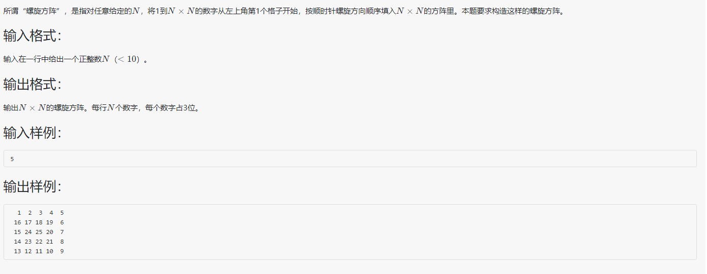

### 题目



<!--more-->

### 找规律

以走一圈为单位：

**①**. 1列~n列，2行~n行，n-1列~1列，n-1行~2行。(``begin~end``,``begin+1~end``,``end-1~begin``,``end-1~begin+1``)

**②**. 开头改为2列，结束改为n-1列，规律不变，类推。

### 代码区

```c++
#include<iostream>
using namespace std;
void deal(int arr[][20],int n)//二维数组传参需要给定一维的长度，否则报错
{
	int num=0;//计数（自增） 
	int i,j,begin,end;//循环用量与边界量 
	int limit;//退出循环的判断条件
	begin=1;end=n;//表示n阶方阵
	if(n%2==0)	limit=n*n;//偶数退出条件：如4*4的退出条件是16
	else 	limit=n*n-1;//奇数退出条件：如5*5的退出条件是24 
	while(num!=limit)
	{
		for(i=begin,j=begin;j<=end;j++)	arr[i][j]=(++num);//右移 
		for(i=begin+1,j=end;i<=end;i++)	arr[i][j]=(++num);//下移 
		for(i=end,j=end-1;j>=begin;j--)	arr[i][j]=(++num);//左移 
		for(i=end-1,j=begin;i>=begin+1;i--)	arr[i][j]=(++num);//上移 
		begin++;end--;//换行 
	}
	if(n%2!=0)	arr[n/2+1][n/2+1]=(++num);//奇数的方阵要补正中央元素的值 
}
int main()
{
	int arr[20][20],n;cin>>n;
	deal(arr,n);
	for(int i=1;i<=n;i++)//输出方阵
	{
		for(int j=1;j<=n;j++)
			printf("%3d",arr[i][j]);
		cout<<endl;
	}
}
```

**规律和方法其实很多，还是每个人有其不同的解法吧。**