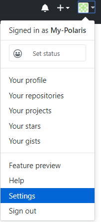
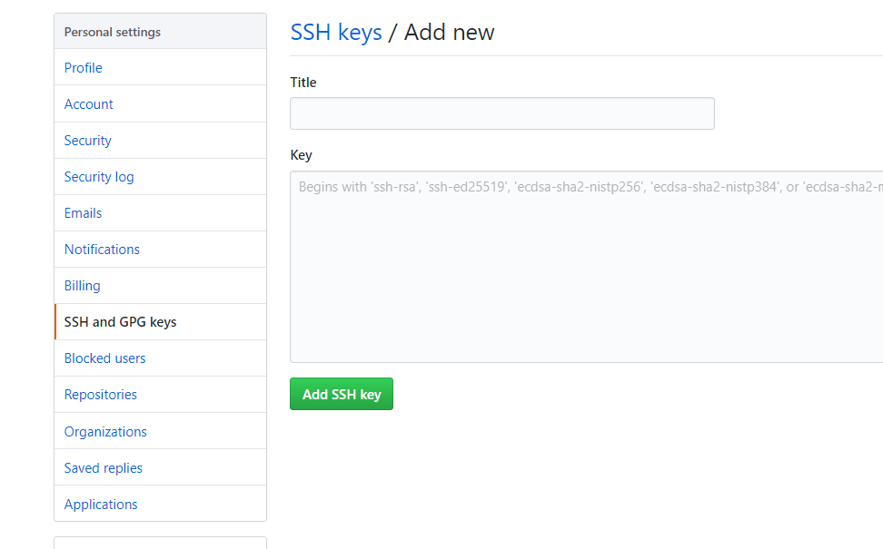

**————困难总结**
<!--more-->
## *针对过程所遇到的困难*

其实最大的困难就是未知，对于每一项操作没能深切明白其意义，要学会去理解它，这是很重要的。

1.git提供一个将本地库提交到远端的功能（将博客项目托管到三方平台），而其本身是``分布式版本控制系统``,也有着很多功能（如建立一个在网上的仓库）。

2.github就类似于git的远程仓库，负责提供一个网站。

3.ssh密钥其实就是连接这台电脑的git和你的github的一把钥匙，所以放哪个盘都无所谓，只要在这个电脑里。（而换电脑之后也需要重新配密钥）

> 其实GitHub就是一个服务器(远程的电脑)，像linux与mac系统一样，当你想要访问这个服务器时就在终端用``ssh 用户名@ip``，而用``ssh-keygen``创建钥匙后，让GitHub(服务器)记住你的钥匙(电脑的信息)，这样之后你对这个服务器的访问都不需要再输入密码

4.hexo是网页的一个博客框架，负责构造出自己想要的博客。（需要用cmd``命令提示符``去安装）

5.node.js是构造hexo所需要的一个前提，具体功能是创建一个能够在服务器端运行JavaScript代码的环境。（因为hexo生成的网页多是用JavaScript写的）

6.markdown是一种文本编辑方式，它能更轻易的实现文字的排版。

7.Front-matter是指每个Markdown文件最上方以`---`分隔的区域，可以编写它用来对文件的布局(layout)、标题(title)、分类(categories)、标签(tags)、发布日期(date),更新日期(updated)等信息加以说明。

8.补充一下，最近接触到``hexo s -p 8000 -o``，其中-p后面表示的是切换服务器端口，但其实没多大差别，主要是-o，可以在形成预览界面后直接用默认浏览器打开，不用在对服务器的默认网址复制黏贴去访问了。

### 一、github账号注册
**~~第一步当然是搜索教程啦~~    	在GitHub上注册账号**

遇到的问题：在github注册的时候，总是不给我注册的邮箱发信息，导致注册延缓

解决办法：尝试了多个浏览器（谷歌，金山，火狐），结果最后是在手机的浏览器上发送成功了- -

### 二、SSH的配置

**下载Git，打开git bash设置配置信息、生成ssh密钥文件**

遇到的问题：找不到id_rsa.pub的密钥要存放到GitHub的位置

位置如下：





（这里我顺便去学了git的相关知识），[廖雪峰的git操作教程](https://www.liaoxuefeng.com/wiki/0013739516305929606dd18361248578c67b8067c8c017b000)，他的教程是由浅入深的介绍和教学，很心急的同学就不推荐看了，但对于想一探究竟的，真的是超友好。

### 三、博客编辑

**对markdown编辑软件的选取**

遇到的问题：起初下的markdownpad2对markdown语言的解析并不好。

解决办法：后来换成了Typora好多了。

### 四、文章中图片无法传到网上

解决办法：1.将hexo根目录下_config.yml的post_asset_folder: false改为true

​				  2.在hexo根目录下安装插件：``npm install https://github.com/CodeFalling/hexo-asset-image --save`` （cmd中执行）（npm命令是node.js的包管理工具，安装hexo的时候也用到了，可以用node.js执行命令）

​				  3.在这之后都将文章的图片放在（与文章）同一层目录对应的同名文件夹中，引用时用！【】（文件名/照片名.png || jpg）**这里的‘/’很重要，不能是‘\’**。

### 五、相册功能的实现

找遍了教程，才总结出大致**思路**：

1.建立一个photos.html页面（_post同级文件夹），引入相册的样式代码，这些代码负责给出相册页面的框架并将线上仓库的图片链接过来。

2.建立线上仓库（与本地仓库连接，所以这里其实应叫远程库），这里在Github上建（七牛的图床也可以），这里又涉及git的基本知识。

3.因为第一步中图片数据来源是json文件，所以需要脚本做到：将本地仓库的图片压缩裁剪出缩略图并存储，将图片文件处理成json格式并上传到远程库（Github的仓库，也可以是七牛的图床），同时更新photos.html页面的信息。

执行过程遇到的**问题**：

1.采用别人的python脚本代码时 ,将问题引向了python的使用问题：

首先是安装与环境变量的配置，确认过python交互模式下可以运行后，运行tool.py时报错PIL(python的图形处理工具)，解决办法是需要安装pillow，此时cmd的安装pillow命令又报错，网上解决办法不统一又无针对性，尝试多次还是失败。

其实遇到的是``解决问题的途径``的问题,针对``cmd安装pillow命令时的报错``找解决方法，无果。最后想到能换一个角度，从``安装pillow的方式``解决。

2.缩略图无法显示

关键是引入empty.png，但依照网上方法引入之后还是无法解决。

最后，我用网页调试模式（浏览器开发者模式）（F12），找出缩略图对应的源代码src:``\photos\ins.j\img\empty.png``,于是将错就错，建立对应文件夹并把empty放至该路径，这才解决。

3.相册功能时而失效，图片无法显示

由于图片我是挂在了github，而github的CDN域名污染频繁，本地的hosts文件识别解析网站受阻，所以需要更改本地的hosts文件。

具体实现参考：https://blog.csdn.net/qq_38232598/article/details/91346392#comments_12133314。

> 一开始建博客的时候其实同时看了好几个教程，已经记不清看的哪个了，不过建完后看到一个挺好的[教程](https://github.com/jackfrued/Python-100-Days/blob/master/%E7%95%AA%E5%A4%96%E7%AF%87/%E4%BD%BF%E7%94%A8Hexo%E6%90%AD%E5%BB%BA%E8%87%AA%E5%B7%B1%E7%9A%84%E5%8D%9A%E5%AE%A2.md)，也是GitHub 的一个项目，虽然这个项目本身应该是教python的hh，但教程里有边教边介绍，所以还挺好的。
>

总结来说，建博客过程还是很繁琐、很麻烦，有时出现问题，似乎连百度都帮不了你。~~(关键词找的好，谷歌让你没烦恼)~~

​		**不过，总是要学习、探索，才会使未来变得可期。**

> **温馨提示**：最近，国内访问GitHub会因为DNS（域名解析服务）的问题出现**图片无法显示**的情况，如果你也**遇到**了这样的问题，可以通过**修改本机的`hosts`文件直接**对GitHub的资源链接进行域名解析来解决。使用Windows系统的读者可以参考[《在Windows上如何管理主机文件》](https://sspai.com/post/43248)一文来进行操作。把下面的内容添加到`hosts`文件的末尾，这样就可以解决GitHub上图片无法显示的问题。

```
151.101.184.133assets-cdn.github.com
151.101.184.133 raw.githubusercontent.com
151.101.184.133 gist.githubusercontent.com
151.101.184.133 cloud.githubusercontent.com
151.101.184.133 camo.githubusercontent.com
```


